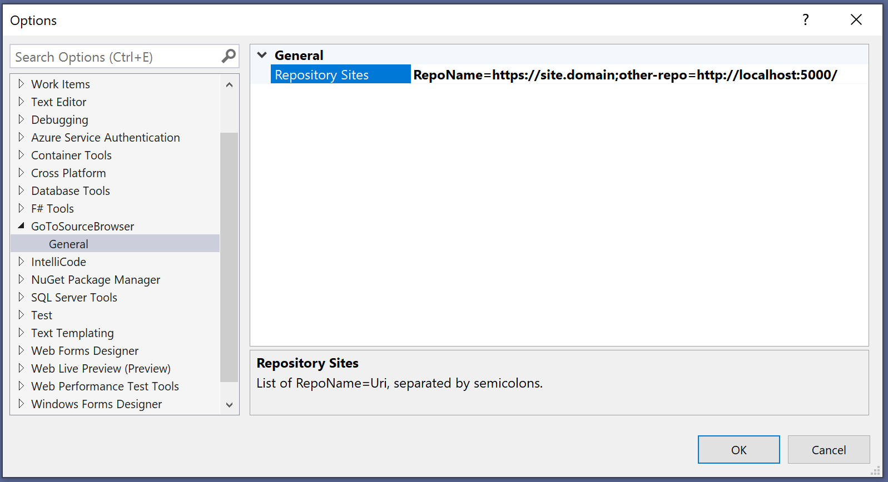

# GoToSourceBrowser

Simple Visual Studio Extension (vsix) to open current code in Source Browser.

This is useful when current solution do not include all repo projects.

# Load

Extension is automatically loaded when opening a solution.

# Options

Each repository can be associated with a dedicated Source Browser uri.

To match repositories and URIs, it uses the name of the repository in git remote URIs.

